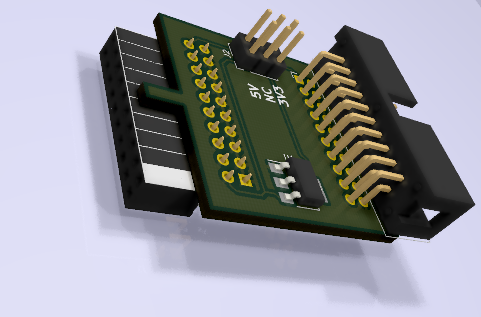
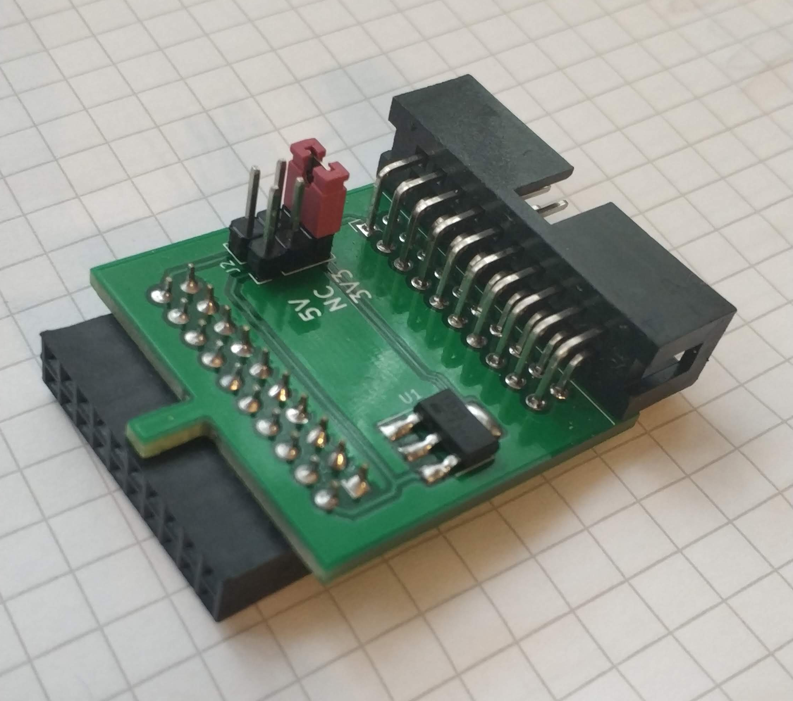
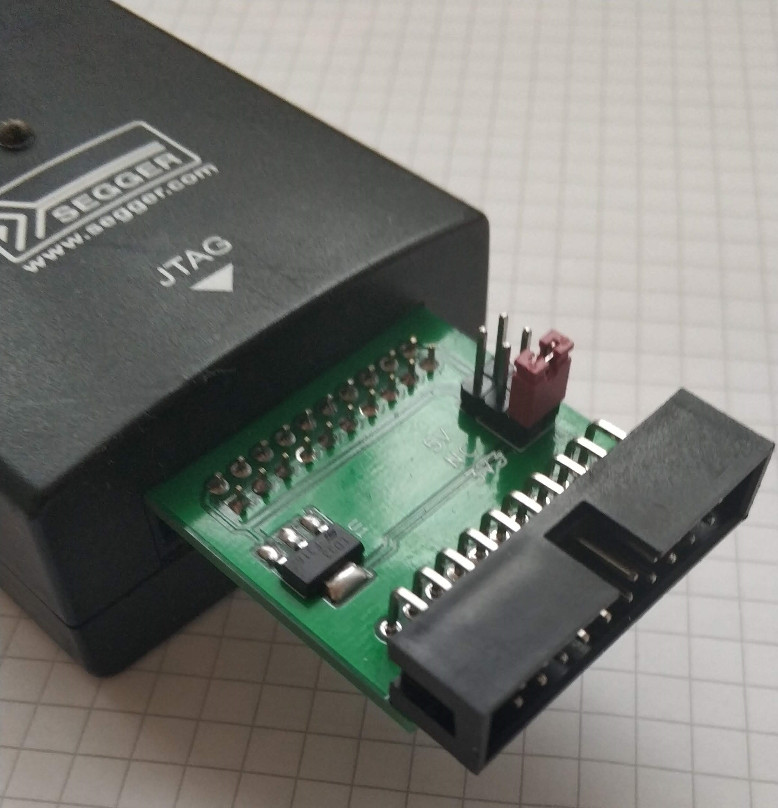

# Jlink_Power_Supply

## Project background
It's a simple project which help me in my work. I face a problem that I have to supply micro with 3V3.
J-Link allow us to supply only with 5V so I design this board to solve that problem. 

## Schematic
Schematic is very simple but if you need you can find it [here](Docs/Schematic.pdf)

## 3D Render

## Real photos

